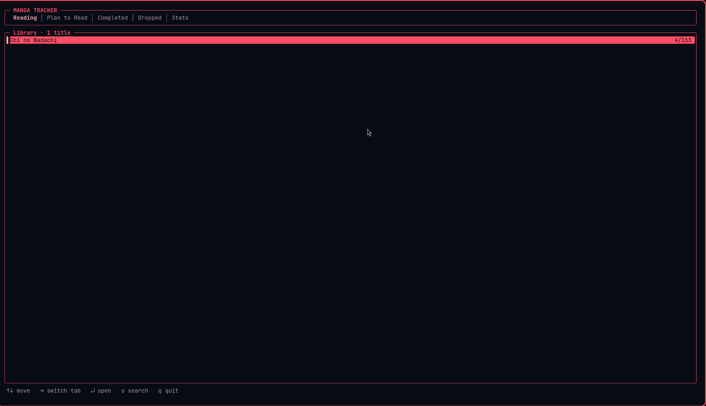
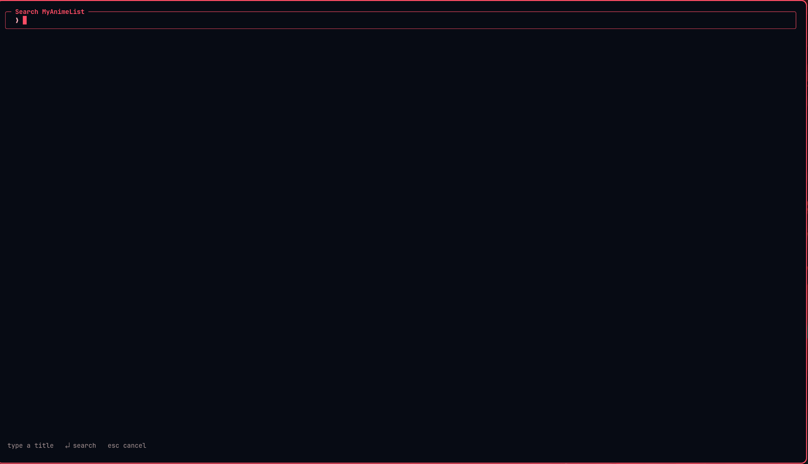
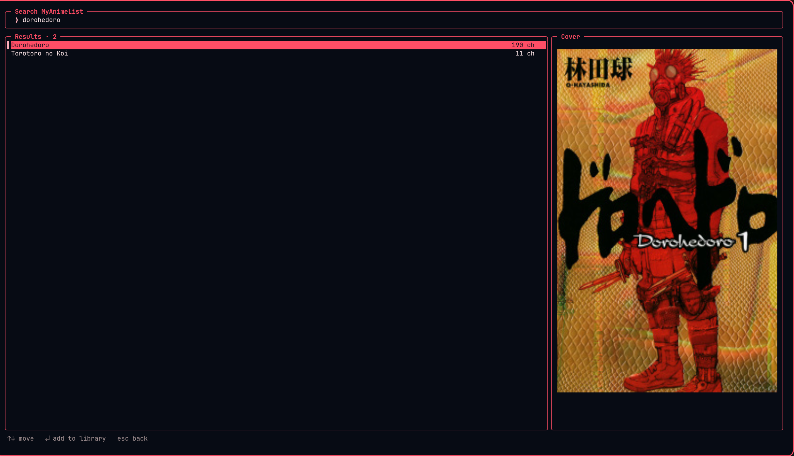

# manga-tracker

A terminal-based manga reading tracker built in Java. Search for manga via the Jikan API, track your reading progress across four lists, and view cover art directly in your terminal.



---

## Features

- Tab-bar dashboard for the four lists — Reading, Plan to Read, Completed, Dropped
- Stats tab — chapters/volumes read, completed count, breakdowns by status, demographic, and tags
- Search the MyAnimeList database via the [Jikan API](https://jikan.moe/) without an API key
- Live cover preview while browsing search results
- Track chapter progress with gauges and automatic completion prompts
- Add and remove manga from the tracker
- Cover art rendered inline using the [Kitty graphics protocol](https://sw.kovidgoyal.net/kitty/graphics-protocol/) on supported terminals
- Persistent SQLite storage — no server required
- Fully keyboard-driven TUI that adapts to your terminal size

---

## Terminal Compatibility

Cover art rendering requires a terminal that supports the [Kitty graphics protocol](https://sw.kovidgoyal.net/kitty/graphics-protocol/). Personally tested on Fedora with Ghostty.

| Terminal | Cover Art |
|----------|-----------|
| [Kitty](https://sw.kovidgoyal.net/kitty/) | ✅ |
| [Ghostty](https://ghostty.org/) | ✅ |
| [Konsole](https://konsole.kde.org/) | ✅ |
| Everything else | ✅ (text only, no cover art) |

To add support for another Kitty-protocol-compatible terminal, edit the `isSupported()` method in `KittyRenderer.java`.

---


## Screenshots

| Main Menu | Search | Detail View |
|-----------|--------|-------------|
|  |  <br><br> **Search Results:** <br>  |  |
---

## Requirements

- Java 21 or later
- A terminal emulator (cover art requires Kitty, Ghostty, or Konsole)

---

## Installation

Download the latest `manga_tracker.jar` from the [Releases](../../releases) page.

```bash
java -jar manga_tracker.jar
```

The database file `manga-tracker.db` is created in the directory you run the command from. Run from the same directory each time to keep your data.

---

## Usage

| Key | Action |
|-----|--------|
| `↑` / `↓` | Move selection |
| `Tab` / `←` / `→` | Switch tab |
| `1`–`4` | Jump to a status tab |
| `5` | Stats tab |
| `Enter` | Confirm / open |
| `Esc` | Go back |
| `s` | Search MyAnimeList |
| `+` / `-` | Increment / decrement chapter |
| `e` | Set exact chapter (fix misinputs) |
| `d` | Drop manga |
| `r` | Resume dropped manga |
| `x` | Remove manga from tracker |
| `n` / `p` | Next / previous page |
| `q` | Quit |

---

## Tech Stack

- **Java 25** — core language
- **SQLite** via [sqlite-jdbc](https://github.com/xerial/sqlite-jdbc) — local persistence
- **Lanterna** — terminal UI rendering
- **Jackson** — JSON parsing
- **Jikan API v4** — manga metadata and search
- **Maven Shade Plugin** — fat jar packaging

---

## Building from Source

```bash
git clone https://github.com/roman11x/manga-tracker.git
cd manga-tracker
mvn package -DskipTests
java -jar target/manga_tracker.jar
```

---

## License

MIT — see [LICENSE](LICENSE)